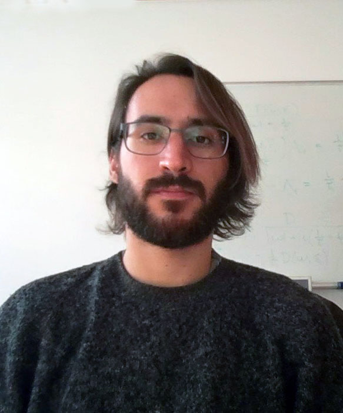

## The Bonn Journal Club on Condendensed Matter Theory \ Physikalisches Institut, Uni Bonn

We are now in the second year of the Journal Club. Details about talks from the previous season can be found here. 

[Season 1: WiSe22-SoSe23](https://sagnikrg.github.io/cond-mat-bonn/Season-1/)\
[Season 2: WiSe23](https://sagnikrg.github.io/cond-mat-bonn/Season-2/)\
[Season 3: SoSe24](https://sagnikrg.github.io/cond-mat-bonn/Season-3/)

Want to get updates about regular talks? Join our mailing list:

[[listen.uni-bonn.de/wws/subscribe](
https://listen.uni-bonn.de/wws/subscribe/cond-mat-bonn?previous_action=info
)]

The Visitor Gieger Counter :

## Talks This Season:

| Speaker           | Date    | Title |
| :---------------- | :------ | :---- |
| **1.** Dr. Franco Lisandrini (AG Kollath) | October 18, 2023 (Wednesday)| Partially disordered Hiesenberg antiferromagnet with short range stripe correlations |
| | |  [[Slides](https://sagnikrg.github.io/cond-mat-bonn/Season-2/Franco_Slides.pdf)],[[Abstract](https://sagnikrg.github.io/cond-mat-bonn/Season-2#abs_franco)] |
| **2.**Kriti Baweja (AG Luitz)  | November 08, 2023 (Wednesday)| Weak measurements in the ground state of 2-D Antiferromagnetic Heisenberg model| 
| | | [[Slides](https://sagnikrg.github.io/cond-mat-bonn/Season-2/Kriti_Slides.pdf)],[[Abstract](https://sagnikrg.github.io/cond-mat-bonn/Season-2#abs_kriti)] |
| **3.**Julien Breiher  (AG Luitz) | November 15, 2023 (Wednesday)| The simulation of Clifford Circuits : The Gottesman-Knill theorem| 
| | | [[Slides](https://sagnikrg.github.io/cond-mat-bonn/Season-2/Julien_Slides.pdf)],[[Abstract](https://sagnikrg.github.io/cond-mat-bonn/Season-2#abs_julien)] |
| **4.**Michael Hübner, Oliver Freyermuth  (IT Dept.)  | November 29, 2023 (Wednesday)| News from the IT department and Cluster Computing | 
| | | [[Slides](https://sagnikrg.github.io/cond-mat-bonn/Season-2/Oliver_Slides.pdf)],[[Abstract](https://sagnikrg.github.io/cond-mat-bonn/Season-2#abs_oliver)] |
| **5.**Dr. Sayak Ray (AG Kroha) | December 06, 2023 (Wednesday)|   Bistability dynamics in the dissipative Dicke-Bose-Hubbard system |
| | | [[Slides](https://sagnikrg.github.io/cond-mat-bonn/Season-2/Sayak_Slides.pdf)],[[Abstract](https://sagnikrg.github.io/cond-mat-bonn/Season-2#abs_sayak)] |

<!--| **2.**Julien Breiher (AG Luitz)  | May 15, 2023 (Wednesday)| TBA| 
<!--| | | [[Slides](https://sagnikrg.github.io/cond-mat-bonn/Season-2/Julien_Slides.pdf)],[[Abstract](https://sagnikrg.github.io/cond-mat-bonn/Season-2#abs_julien)] |
 This is a comment in Markdown and it will not appear in the output. -->

## Details of Talks:

 
**1. May 08, 2024 (Wednesday)**

 
 
**Title:**  Finite-temperature Simulations with Stochastic Matrix Product States

**Speaker:**  Dr. Franco Lisandrini (AG Kollath)

**Abstract:** 

 

   In this JC talk I will present Stochastic MPS, a method for simulating finite-temperate (quasi-)one-dimensional systems proposed in a preprint from last December (https://arxiv.org/abs/2312.04420). Before that, I will briefly introduce other finite-temperature methods commonly used with MPS (Purification and METTS).

**2. May 15, 2024 (Wednesday)**

 
 
**Title:**  TBA

**Speaker:** Julien Breiher (AG Luitz) 

**Abstract:** 

 

   

 

