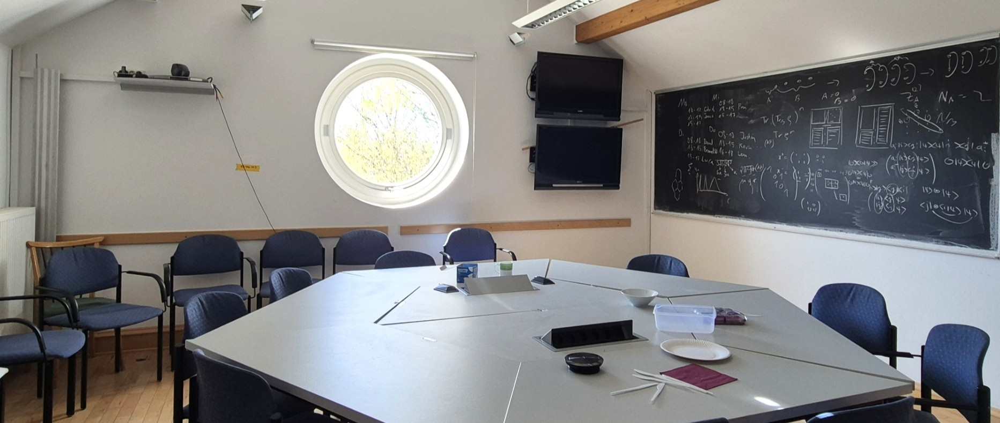

## The Bonn Journal Club on Condendensed Matter Theory \ Physikalisches Institut, Uni Bonn

Image ©: Sagnik Ghosh

The Condensed Matter Journal Club ususally meets every **Wednesday** at **11:00 AM (sharp!)** 

In the PI 3rd floor coffee room (PI 3.014)

Usually when the academic semester is on!

Want to get updates about regular talks? Join our mailing list:

[[listen.uni-bonn.de/wws/subscribe](
https://listen.uni-bonn.de/wws/subscribe/cond-mat-bonn?previous_action=info
)]

There is a permanent Indico Instance:

[https://indico.hiskp.uni-bonn.de/category/37](https://indico.hiskp.uni-bonn.de/category/37/)

You can also directly use this ical link to sync events to your own calender:

  <strong>Calendar Link:</strong>
  <code id="calendarLink">https://indico.hiskp.uni-bonn.de/category/37/events.ics</code>
  <button onclick="copyToClipboard()">Copy</button>

## Talks This Season:

| Speaker           | Date    | Title |
| :---------------- | :------ | :---- |
| **1.** Dr. Maxime Debertolis (AG Luitz) | April 23, 2025 (Wednesday)| TBA |
| | |  [[Slides]()],[[Abstract](#abs_Maxime)] |

The Visitor Gieger Counter :

## Journal Club Archive:

[Season 1: WiSe22-SoSe23](https://sagnikrg.github.io/cond-mat-bonn/Season-1/)\
[Season 2: WiSe23](https://sagnikrg.github.io/cond-mat-bonn/Season-2/)\
[Season 3: SoSe24](https://sagnikrg.github.io/cond-mat-bonn/Season-3/)\
[Season 4: SoSe25](https://sagnikrg.github.io/cond-mat-bonn/Season-4/)

<!--| **2.**Julien Breiher (AG Luitz)  | May 15, 2023 (Wednesday)| TBA| 
<!--| | | [[Slides](https://sagnikrg.github.io/cond-mat-bonn/Season-2/Julien_Slides.pdf)],[[Abstract](https://sagnikrg.github.io/cond-mat-bonn/Season-2#abs_julien)] |
 This is a comment in Markdown and it will not appear in the output. -->

## Details of Talks:

 
**1. April 23, 2025 (Wednesday)**

**Title:**  TBA

**Speaker:**  Dr. Maxime Debertolis (AG Luitz)

**Abstract:** 

 

   TBA

 

