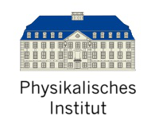

## The Bonn Journal Club on Condendensed Matter Theory \ Physikalisches Institut, Uni Bonn

We are now in the third year of the Journal Club! 

The Condensed Matter Journal Club ususally meets\

every **Wednesday** at **11:00 AM (sharp!)** \

In the PI 3rd floor coffee room (PI 3.014)

Usually when the academic semester is on!

## Journal Club Archive:

[Season 1: WiSe22-SoSe23](https://sagnikrg.github.io/cond-mat-bonn/Season-1/)\
[Season 2: WiSe23](https://sagnikrg.github.io/cond-mat-bonn/Season-2/)\
[Season 3: SoSe24](https://sagnikrg.github.io/cond-mat-bonn/Season-3/)\
[Season 4: SoSe25](https://sagnikrg.github.io/cond-mat-bonn/Season-4/)

Want to get updates about regular talks? Join our mailing list:

[[listen.uni-bonn.de/wws/subscribe](
https://listen.uni-bonn.de/wws/subscribe/cond-mat-bonn?previous_action=info
)]

The Visitor Gieger Counter :

## Talks This Season:

| Speaker           | Date    | Title |
| :---------------- | :------ | :---- |
| **1.** Dr. Maxime Debertolis (AG Luitz) | April 23, 2025 (Wednesday)| TBA |
| | |  [[Slides]()],[[Abstract](https://sagnikrg.github.io/cond-mat-bonn/Season-4#abs_Maxime)] |

<!--| **2.**Julien Breiher (AG Luitz)  | May 15, 2023 (Wednesday)| TBA| 
<!--| | | [[Slides](https://sagnikrg.github.io/cond-mat-bonn/Season-2/Julien_Slides.pdf)],[[Abstract](https://sagnikrg.github.io/cond-mat-bonn/Season-2#abs_julien)] |
 This is a comment in Markdown and it will not appear in the output. -->

## Details of Talks:

 
**1. April 23, 2025 (Wednesday)**

**Title:**  TBA

**Speaker:**  Dr. Maxime Debertolis (AG Luitz)

**Abstract:** 

 

   TBA

 

